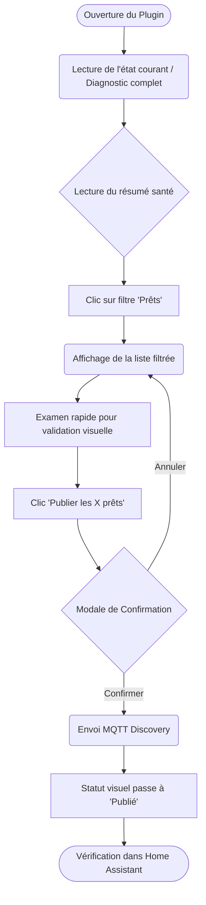
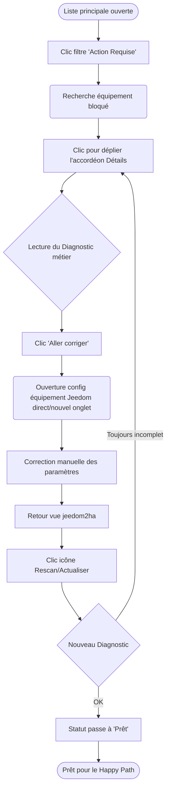
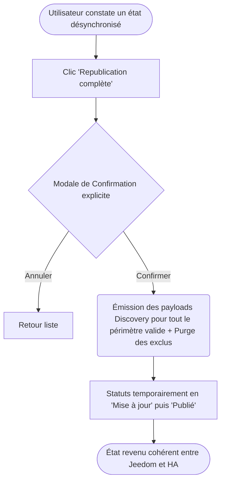

# UX Design Specification jeedom2ha

**Author:** Alexandre
**Date:** 2026-03-12T20:33:30+01:00

---

<!-- UX design content will be appended sequentially through collaborative workflow steps -->

## Executive Summary

### Project Vision

jeedom2ha est un plugin Jeedom avec démon Python conçu comme une couche d’interopérabilité local-first entre Jeedom et Home Assistant via MQTT Discovery. Il vise à réduire fortement la friction de coexistence ou de transition progressive en exposant automatiquement les usages essentiels d’une installation Jeedom dans Home Assistant, avec un pilotage simple HA → Jeedom sur le périmètre MVP et une synchronisation d’état fiable sur les équipements supportés.

**En résumé :** jeedom2ha permet à un utilisateur Jeedom de retrouver rapidement dans Home Assistant une version utile de sa maison, sans migration lourde ni reconstruction manuelle.

### Target Users

La cible principale est constituée d’utilisateurs Jeedom avancés ou intermédiaires disposant déjà d’une installation existante, souvent riche et historique, et souhaitant bénéficier des avantages de Home Assistant sans migration brutale ni reconstruction manuelle. Ils veulent préserver leur investissement Jeedom tout en accédant à une interface plus moderne, à l’écosystème HA, et à terme à des usages voix / IA / Matter.

### Key Design Challenges

- **Onboarding pédagogique :** aider l’utilisateur à comprendre ce qui pourra être publié et ce qui nécessite une remise en ordre côté Jeedom, sans rendre la préparation décourageante.
- **Diagnostic actionnable :** fournir, équipement par équipement, une explication claire du statut de publication et une remédiation concrète.
- **Contrôle de l’exposition :** permettre à l’utilisateur de décider simplement et sûrement ce qui est publié vers HA, afin d’éviter doublons, bruit et exposition involontaire de commandes sensibles.
- **Première impression réussie :** éviter les deux échecs majeurs du produit, à savoir la “vitrine vide” et le “HA pollué”.

### Design Opportunities

- **Prévisualisation de publication (Post-MVP) :** offrir une vue “ce qui sera publié dans HA” avant publication réelle, pour rassurer l’utilisateur et réduire les erreurs.
- **Parcours de correction guidé :** transformer le diagnostic en actions concrètes de remédiation, plutôt qu’en simple liste d’erreurs.
- **Vue de santé du pont (Post-MVP) :** proposer à terme un tableau de bord simple sur l’état du bridge (broker, démon, dernière synchro, erreurs récentes), surtout utile pour les profils avancés et le support.

## Core User Experience

### Defining Experience

L’expérience fondamentale de jeedom2ha ne se situe pas dans l’usage quotidien — qui se fera principalement dans Home Assistant — mais dans la phase de configuration initiale et de maintenance. Le moment clé est la **première publication** : l’utilisateur doit pouvoir valider le périmètre publié, lancer la publication vers HA, et voir apparaître rapidement une version utile, propre et fonctionnelle de sa maison Jeedom, sans configuration YAML ni nettoyage manuel a posteriori.

### Platform Strategy

L’expérience cible prioritairement un usage **desktop web** au sein de l’interface d’administration Jeedom. La configuration d’un pont d’interopérabilité, la résolution de conflits de typage et l’analyse de diagnostic sont des tâches techniques qui requièrent une vue d’ensemble. L’usage mobile reste possible mais secondaire. Les composants UI (tableaux, filtres, vues de diagnostic) doivent donc être pensés **desktop-first**.

### Effortless Interactions

Pour réduire la friction inhérente à ces tâches techniques :
- détection et configuration automatique de la connexion MQTT quand MQTT Manager est utilisé ;
- application transparente du moteur de mapping pour les équipements standards ;
- exclusion simple d’un équipement de la publication, sans parcours complexe ;
- affichage immédiat du statut de chaque équipement : publiable, partiellement publiable, non publiable, avec raison claire.

### Critical Success Moments

1. **Le diagnostic révélateur** : l’instant où l’utilisateur découvre l’état de préparation de son installation Jeedom — équipements publiables immédiatement, partiellement publiables, ou à corriger — de manière claire et non culpabilisante.
2. **La preuve de valeur rapide** : réussir à publier un premier équipement simple et le piloter avec succès depuis Home Assistant dans les premières minutes qui suivent l’installation et la configuration du plugin.

### Experience Principles

- **Validation explicite du périmètre** : le système prépare automatiquement la publication, mais l’utilisateur garde une validation consciente de ce qui franchit le pont.
- **Remédiation immédiate** : toute impasse technique détectée doit s’accompagner d’un chemin court pour la résoudre.
- **Prévisible plutôt que magique** : le plugin doit toujours pouvoir expliquer ce qu’il fait, ce qu’il ne fait pas, et pourquoi.
- **Principe de moindre nuisance** : dans le doute, ne rien publier plutôt que polluer Home Assistant avec des entités cassées, redondantes ou inutiles.

## Desired Emotional Response

### Primary Emotional Goals
L’émotion centrale que `jeedom2ha` doit susciter est le **soulagement accompagné d’un sentiment de maîtrise**. L’utilisateur, potentiellement anxieux face à la complexité d’une intégration entre deux écosystèmes, doit être rassuré par la prévisibilité de l’outil. Le plugin ne doit pas chercher à impressionner par la “magie”, mais à rassurer par sa transparence, sa lisibilité et sa fiabilité technique.

### Emotional Journey Mapping
- **Installation & découverte :** passage du scepticisme (“Est-ce encore un pont compliqué ?”) à l’intérêt, grâce à une interface claire qui expose les prérequis sans détour.
- **Phase de diagnostic :** clarté rassurante. L’utilisateur comprend où il en est, ce qui est publiable, ce qui ne l’est pas encore, et pourquoi.
- **Moment de publication :** satisfaction et soulagement. Le passage de Jeedom vers Home Assistant se fait sans friction inattendue.
- **Résolution de problème :** confiance conservée. Face à un comportement inattendu, l’utilisateur n’est pas abandonné : l’outil explique le problème et oriente vers l’action suivante.

### Micro-Emotions
- **Confiance > Anxiété :** le design anticipe la peur de polluer ou de casser Home Assistant grâce à un diagnostic préalable, une validation explicite du périmètre publié, et une logique de publication conservative.
- **Clarté > Confusion :** l’outil ne doit jamais se comporter comme une boîte noire. Si un équipement n’est pas publié, la raison doit être visible et compréhensible.
- **Valorisation > Frustration :** l’interface doit traiter l’installation Jeedom existante comme un actif à valoriser, pas comme un héritage défaillant qu’il faudrait “réparer” avant toute chose.
- **Maîtrise > Impuissance :** l’utilisateur doit sentir qu’il garde le contrôle sur ce qui est publié, exclu, corrigé ou republié.

### Design Implications
- **Confiance par la prévisibilité :** éviter les comportements surprenants. Toute action importante ou potentiellement impactante doit être accompagnée d’un résumé clair.
- **Clarté par la hiérarchie visuelle :** utiliser un code couleur mesuré et rassurant. Le rouge doit être réservé aux pannes réelles d’infrastructure ; les problèmes de configuration doivent être signalés comme des actions requises, pas comme des catastrophes.
- **Maîtrise par le wording :** adopter un ton professionnel, concis et rassurant, en expliquant les concepts techniques sans noyer l’utilisateur dans le jargon bas niveau.
- **Lisibilité technique :** les informations techniques utiles aux utilisateurs avancés doivent être facilement repérables, sans envahir l’interface principale.

### Emotional Design Principles
- **La transparence rassure :** expliquer “pourquoi” vaut mieux que masquer la complexité.
- **L’erreur guide :** une erreur doit toujours déboucher sur une action ou une piste de résolution.
- **La sobriété inspire la confiance :** le produit doit évoquer la robustesse et la stabilité avant de chercher l’effet visuel.
- **Le plugin ne doit jamais surprendre :** il doit toujours être possible de comprendre ce qu’il fait, ce qu’il ne fait pas, et pourquoi.

## UX Pattern Analysis & Inspiration

### Inspiring Products Analysis
1. **Home Assistant (Integrations + Repairs)** : modèle de guidage clair, de statuts explicites et de remédiation actionnable. Très bonne référence pour transformer des problèmes techniques en actions compréhensibles.
2. **Zigbee2MQTT (Frontend)** : référence forte pour la lisibilité opérationnelle d’un pont local gérant de nombreux équipements. Son approche tabulaire dense mais efficace parle bien aux utilisateurs techniques.
3. **Jeedom Core (V4.4+)** : environnement hôte incontournable. Le plugin doit sembler naturel dans Jeedom, en réutilisant ses conventions d’interface sans reprendre ses lourdeurs historiques.
4. **UniFi Network** : inspiration utile pour la vue de santé globale, la hiérarchie visuelle et la sensation de maîtrise sereine d’un système technique.

### Transferable UX Patterns
**Navigation & Layout**
- Liste principale lisible avec statuts visibles immédiatement.
- Vue de détail non disruptive permettant d’inspecter un équipement sans perdre le contexte global.
- Filtres rapides par statut : prêts, partiels, actions requises, exclus.

**Interaction Patterns**
- Validation explicite du périmètre publié.
- Exclusion simple d’un équipement.
- Actions groupées uniquement si elles restent simples, sûres et compréhensibles.
- Accès direct à une remédiation quand un problème est détecté.

**Visual Patterns**
- Badges de statut explicites et cohérents.
- Couleurs mesurées : vert = prêt, jaune/orange = action requise, gris = exclu/ignoré, rouge = panne réelle.
- Hiérarchie visuelle claire entre santé globale, liste d’équipements et détail local.

### Anti-Patterns to Avoid
- **Le mur de JSON** : exposer la tuyauterie MQTT au lieu d’expliquer le problème dans le vocabulaire utilisateur.
- **Le tableau infini à cases à cocher** : surcharge cognitive typique de certains écrans Jeedom.
- **L’intégration alien** : recréer Home Assistant dans Jeedom au lieu de construire un excellent plugin Jeedom.
- **L’automatisation opaque** : publier, modifier ou supprimer sans que l’utilisateur comprenne ce qui va se passer.

### Design Inspiration Strategy
**Ce que nous adoptons**
- la clarté de guidage et de remédiation de Home Assistant ;
- la lisibilité tabulaire de Zigbee2MQTT ;
- la familiarité des composants Jeedom ;
- la vue de santé rassurante d’UniFi.

**Ce que nous adaptons**
- les composants Jeedom en version allégée, recentrée sur la publication et le diagnostic ;
- les patterns d’outils techniques pour les rendre actionnables plutôt qu’intimidants.

**Ce que nous évitons**
- la complexité brute des outils orientés développeurs ;
- la duplication de l’UX Home Assistant dans Jeedom ;
- toute magie difficile à expliquer ou à corriger.

## Design System Foundation

### Design System Choice
**Jeedom Core UI (v4.4+) — approche “Native-Clean”**

Le plugin `jeedom2ha` s’appuie prioritairement sur les composants, conventions visuelles et patterns d’interaction natifs du Core Jeedom. L’objectif n’est pas d’introduire un design system externe, mais de produire une interface plus lisible, plus sobre et plus guidée à partir du socle existant.

### Rationale for Selection
1. **Familiarité et confiance** : le plugin doit sembler faire naturellement partie de Jeedom.
2. **Cohérence d’écosystème** : l’utilisateur doit retrouver les repères d’interaction habituels du Core.
3. **Soutenabilité MVP** : éviter l’introduction d’une couche front-end lourde qui augmenterait la dette technique sans créer de valeur produit suffisante.
4. **Compatibilité visuelle** : maximiser l’alignement avec les thèmes et conventions Jeedom existants.

### Implementation Approach
- Utilisation prioritaire des composants visuels natifs Jeedom.
- Interface pensée **desktop-first**, avec tolérance raisonnable aux écrans plus petits.
- Sobriété visuelle : masquer agressivement les informations non utiles à l’action immédiate.
- Interactions asynchrones légères via les mécanismes standards Jeedom / JS natif, sans framework front-end lourd.

### Customization Strategy
La différenciation UX du plugin ne repose pas sur une nouvelle charte graphique, mais sur :
- une meilleure hiérarchie de l’information ;
- des statuts plus lisibles ;
- des vues plus aérées ;
- un wording plus clair ;
- et des parcours plus actionnables.

### Design Constraints
- Pas de clone visuel de Home Assistant dans Jeedom.
- Pas de surcharge de tableaux à la manière des anciens écrans de commandes Jeedom.
- Pas de dépendance forte à des styles internes fragiles ou à des comportements implicites non maîtrisés.

## 2. Core User Experience

### 2.1 Defining Experience
L’expérience qui définit `jeedom2ha` est la boucle **« Diagnostic → Validation du périmètre → Publication »**, complétée par une boucle de **remédiation → rescan** lorsque certains équipements ne sont pas immédiatement publiables. C’est cet enchaînement qui transforme une intégration potentiellement anxiogène entre Jeedom et Home Assistant en un processus contrôlé, lisible et progressif.

### 2.2 User Mental Model
- **Le besoin :** « Je veux retrouver mes équipements Jeedom dans Home Assistant sous forme d’entités utiles et fonctionnelles, sans les recréer manuellement. »
- **La crainte principale :** perdre le contrôle — polluer HA, dupliquer des équipements, ou exposer des commandes non souhaitées.
- **La croyance actuelle :** faire cohabiter Jeedom et HA demande une forte expertise technique.

### 2.3 Success Criteria
1. **Prévisibilité forte :** l’utilisateur comprend clairement ce qui est publiable, ce qui ne l’est pas encore, et ce qui sera effectivement publié.
2. **Actionnabilité :** un équipement non publiable est toujours accompagné d’une raison compréhensible et d’une piste de résolution.
3. **Progression visible :** l’utilisateur peut améliorer progressivement la couverture de son installation sans devoir tout corriger d’un coup.
4. **Preuve rapide de valeur :** un premier équipement simple peut être publié et vérifié rapidement dans Home Assistant.

### 2.4 Novel vs. Established UX Patterns
L’UX doit reposer principalement sur des **patterns établis et rassurants** :
- listes filtrables par statut ;
- badges de statut explicites ;
- confirmations avant actions importantes ;
- feedback clair après publication.

L’élément le plus distinctif dans l’écosystème Jeedom est la transformation d’un diagnostic technique en **parcours de remédiation actionnable**, inspiré des logiques de “repair” plutôt que du simple logging.

### 2.5 Experience Mechanics
1. **Initiation (Évaluation) :** l’utilisateur ouvre le plugin et visualise l’état de son installation sous forme de statuts clairs : publié, prêt, partiel, action requise, exclu.
2. **Validation du périmètre :** l’utilisateur filtre, comprend le diagnostic, et peut exclure simplement certains équipements de la publication.
3. **Remédiation :** pour les équipements nécessitant une action, le plugin explique la raison principale et oriente l’utilisateur vers la correction à effectuer dans Jeedom.
4. **Publication :** l’utilisateur déclenche la publication ou republication et reçoit un retour clair sur le résultat.
5. **Vérification dans HA :** l’utilisateur constate que les équipements publiés apparaissent proprement dans Home Assistant et que le premier usage simple fonctionne.

## Visual Design Foundation

### Color System
Le plugin n’introduit aucune palette de couleurs propriétaire. Il s’appuie strictement sur les variables sémantiques dynamiques du Core Jeedom. L’application des couleurs est disciplinée pour soutenir l'objectif de maîtrise :
- **Vert (Success/Native) :** succès et préparation ("Prêt", "Publié").
- **Orange/Jaune (Warning/Native) :** étape manquante ou incomplète ("Action Requise", "Partiel"). Indique une configuration, pas une urgence.
- **Gris (Muted/Native) :** effacer visuellement ce qui ne nécessite pas d’attention ("Exclu", "Ignoré").
- **Rouge (Danger/Native) :** usage drastiquement limité aux pannes d’infrastructure réelles (Broker injoignable, Démon stoppé). Ne jamais utiliser le rouge pour signaler une erreur de configuration (ex: type générique manquant).

### Typography System
Le plugin hérite de la police système du thème Jeedom actif. La stratégie typographique vise la clarté :
- **Clarté textuelle :** tailles de polices standards et lisibles.
- **Stabilité Technique ciblée :** police monospace utilisée uniquement pour les données techniques pertinentes (Entity ID, Topic MQTT, UUID) afin d'éviter toute ambiguïté (O vs 0).

### Spacing & Layout Foundation
L’espacement marque la différence qualitative avec les plugins classiques :
- **Densité Allégée :** padding/margin volontairement accrus par rapport aux tableaux Jeedom ultra-denses pour réduire la fatigue visuelle.
- **Layout Preference :** Vue tabulaire (tableaux) **desktop-first**. C'est le format le plus adapté à la gestion d'un parc de 50-100+ équipements. Pas de cartes ou de grille comme vue principale MVP.
- **Structure Prévisible :**
  - *Macro-layout :* Barre de contrôle et filtres en haut (sticky header simple), liste en dessous. L'en-tête indique l'état du pont et les compteurs de statuts.
  - *Micro-layout des listes :* Statut synthétique (badge visuel) toujours ancré à gauche, identifiant au centre, actions groupées à droite. (Statut → Nom → Objet → Type HA pressenti → Diagnostic court → Actions). Maximum 5 à 6 colonnes visibles.

### Layout Principles
- **Table first :** le tableau est la vue principale du MVP.
- **Filtres avant tout :** la segmentation par statut (Tous, Prêts, Partiels, Action requise, Exclu) est prioritaire sur le tri.
- **Détail à la demande :** les informations secondaires (payload MQTT complet, détails avancés) ne doivent pas surcharger la vue principale, elles vont dans un panneau latéral, un accordéon, ou un tooltip.
- **Un écran = une décision :** la liste principale de 5 à 6 colonnes aide à comprendre rapidement quoi publier, quoi corriger, quoi exclure.

### Accessibility Considerations
- **Redondance Visuelle :** ne jamais coder une information *uniquement* par la couleur. Ex: Un badge orange contiendra toujours une icône (⚠️) et un libellé clair.

## Design Direction Decision

### Design Directions Explored
- **Direction 1 (Filter-First Table) :** Approche "Opérationnelle" centrée sur la scannabilité, le filtrage rapide par statut et le traitement par lots.
- **Direction 2 (Master-Detail) :** Approche "Inspection" (Split View) permettant une plongée profonde dans un équipement sans perdre la liste, mais sacrifiant l'espace horizontal.
- **Direction 3 (Accordion List) :** Approche "Détail à la demande" conservant une liste propre mais permettant de déplier une ligne pour voir un diagnostic technique dense.

### Chosen Direction
**Direction 1 (Base MVP) + Direction 3 (Détail à la demande)**

Le choix se porte sur la composition des forces des Directions 1 et 3. Le tableau filtrable (Direction 1) est le layout principal, car il sert parfaitement le besoin d'action rapide et de compréhension globale de l'état du parc. Pour les diagnostics nécessitant plus que quelques mots (ex: détail des commandes manquantes d'un équipement complexe), le pattern de l'accordéon (Direction 3) est utilisé pour afficher la vue détaillée directement sous la ligne concernée, sans casser le contexte visuel global.

### Design Rationale
- Le cœur du produit pour le MVP est d'évaluer, de valider et de publier rapidement, pas d'inspecter unitairement chaque équipement pendant de longues minutes.
- Le filtrage par statut au-dessus du tableau est l'outil principal de l'utilisateur pour traiter les tâches par lots (ex: "Je filtre les Actions Requises pour les corriger").
- Cacher l'information technique dense (payload MQTT brute, types précis) dans un accordéon dépliable satisfait la "Sobriété visuelle" demandée pour le MVP, tout en gardant l'information proche pour la remédiation avancée.
- La Direction 2 (Split View) est écartée pour le MVP car elle alourdit l'interface et donne une impression d'outil "expert/support" plutôt que d'un pont "facile et rassurant".

### Implementation Approach
- La vue principale ne montre que les 5 à 6 colonnes essentielles.
- Le bouton "Publier" principal doit être contextualisé pour éviter toute mauvaise surprise (ex: "Publier les X équipements Prêts") plutôt qu'un "Tout publier" ambigu.
- Tout équipement nécessitant une explication de statut complexe ou des actions secondaires offrira une interaction simple (chevron ou autre mécanique légère inline) pour déplier son diagnostic détaillé.

## User Journey Flows

### 1. Happy Path de Publication en Lot
Le parcours principal, optimisé pour la validation rapide et la publication du périmètre déjà conforme. L'objectif est la rapidité et la confiance.



### 2. Boucle de Remédiation (Diagnostic & Résolution)
Le parcours technique permettant à l'utilisateur de débloquer une situation sans quitter son flux cognitif ni chercher de documentation externe.



### 3. Gestion et Validation du Périmètre (Exclusions)
Le parcours de contrôle rassurant qui limite la pollution de Home Assistant.

```mermaid
flowchart TD
    Start([Liste principale affichée]) --> A{Identification équipement non désiré}
    A -- "Depuis liste" --> B[Clic action 'Exclure']
    A -- "Depuis accordéon Détails" --> BX[Clic action 'Exclure équipement']
    B --> C(Mise à jour configuration interne)
    BX --> C
    C --> D[Statut passe immédiatement à 'Exclu' (Gris) dans l'UI]
    D --> E(L'équipement sort du filtre 'Prêts')
    E --> F{Est-il déjà publié ?}
    F -- "Oui" --> G(Suppression prévue lors de la prochaine republication/synchro)
    F -- "Non" --> End([Pollution HA évitée])
    G --> End
```

### 4. Republication Complète (Recovery)
Un mini-flux annexe essentiel pour forcer la synchronisation de l'ensemble du périmètre valide en cas de désynchronisation perçue.



### Flow Optimization Principles
- **Prévisibilité avant vitesse :** Le flux ne doit jamais optimiser la rapidité au point de masquer ce qui va se passer. On peut publier vite, mais jamais sans résumé clair ni statut explicite.
- **Friction Réduite vers la Valeur :** Le bouton global d'action (ex: "Publier les X prêts") permet un traitement groupé efficace une fois l'inspection terminée.
- **Réversibilité Simple :** L'exclusion d'un équipement se fait en un clic. Ré-inclure un équipement se fait tout aussi simplement depuis le filtre "Exclus". L'application effective côté HA (retrait ou ajout) se fait asynchronement.
- **Externalisation de la Complexité :** Le plugin ne réinvente pas l'interface de paramétrage de Jeedom ; il fournit le diagnostic précis et le lien direct vers la page native pour effectuer la correction.

## Component Strategy

### Design System Components
Le plugin construit son UI en réutilisant au maximum le socle natif du Core Jeedom v4.4+ (structure tabulaire, boutons `btn-XYZ`, bannières d'alerte, modales, icônes FontAwesome). Aucune librairie UI externe (Vue, React, Tailwind, MUI) ne sera ajoutée. 

### Custom Components (Composants Logiques)
Trois "patterns d'interface récurrents" (composants logiques) basés sur le HTML/CSS natif sont définis pour supporter les user journeys spécifiques au plugin :

1. **Status Badge (Badge de Statut Riche)**
   - **Entrée :** Statut métier de l'équipement.
   - **Sortie :** Libellé condensé + Icône + Ton visuel (couleurs sémantiques Jeedom).
   - **Usage :** Partout où un état de préparation ou de publication doit être lu et compris en une fraction de seconde par l'utilisateur (Principalement dans la colonne "Statut"). Ce vocabulaire visuel est strictement verrouillé (Prêt, Publié, Partiel, Action Requise, Exclu, Erreur Système).

2. **Actionable Accordion Row (Ligne Dépliable)**
   - **Entrée :** Objet équipement complet + Rapport de diagnostic.
   - **Sortie :** Détail lisible du motif de blocage (texte + puces) + Actions de remédiation ciblées.
   - **Usage :** Uniquement à la demande, en cliquant sur une ligne de tableau pour comprendre un diagnostic complexe sans perdre le contexte global ni ouvrir une modale bloquante. 

3. **Sticky Control Header (En-tête Fixe de Contrôle)**
   - **Entrée :** État de l'infrastructure + Groupes de filtres + Compteurs de statuts + Bouton d'action contextuel.
   - **Sortie :** Barre de contrôle globale toujours visible en haut de l'écran lors du défilement de la liste principale.
   - **Usage :** Assure la navigation primaire (switch entre les filtres rapides) et l'exécution de l'action principale du "Happy Path" (ex: "Publier les X prêts").

### Component Implementation Strategy
- **Zéro Framework JS externe :** Le HTML sémantique et les variables CSS du Core Jeedom forment la base. Le maintien d'état côté front est minimaliste (pas de "Single Page Application").
- **JS Vanilla & jQuery ciblé :** La logique d'interaction basique (déplier un accordéon, changer l'état d'un bouton de filtre) s'écrira en Vanilla JS (préemptif) ou jQuery (uniquement lorsque cela simplifie drastiquement l'appel aux helpers natifs Jeedom). L'objectif est de ne créer aucune "magie" ou complexité invisible.

### Implementation Roadmap

- **Phase 1 (Le MVP Réel) :** 
  - Status Badges.
  - Tableau filtrable.
  - Sticky Control Header de base.
  - Accordion Row (version simple) pour le diagnostic.
  - CTA contextuel et Feedback de publication immédiate.
  - *Objectif : Rendre le flux de "Validation du périmètre → Remédiation simple → Publication" totalement fonctionnel.*

- **Phase 2 (Amélioration d'Expérience) :** 
  - Accordéon plus riche (détail précis des types HA et commandes Jeedom mapées).
  - Meilleure hiérarchie visuelle dans les détails.
  - Compteurs dynamiques plus fins dans le Sticky Header.
  - Indicateurs de santé du Démon/Broker plus travaillés.

- **Phase 3 (Polish & Micro-interactions) :** 
  - Spinners (indicateurs d'activité) locaux sur les boutons lors des envois MQTT.
  - Transitions plus fluides à l'ouverture des accordéons.
  - Petits raffinements visuels non bloquants.

## UX Consistency Patterns

L’objectif de ces patterns de cohérence est de garantir la prévisibilité de l’interface tout en limitant la surcharge cognitive fréquente dans les interfaces d’administration domotique.

### Button Hierarchy & Action Placement
- **Unicité de l’action primaire :** le bouton principal déclenchant une opération vers Home Assistant est unique par vue, placé dans le Sticky Header, et visuellement dominant (`btn-success` ou équivalent natif). Il comporte toujours un quantificateur explicite (ex : “Publier 12 équipements”).
- **Actions de ligne :** les actions propres à un équipement (Corriger, Exclure, Réinclure) utilisent un poids visuel secondaire.
- **Icônes non suffisantes :** une icône seule ne peut pas porter une action métier ambiguë. Toute action significative doit être accompagnée d’un libellé textuel clair.

### Feedback Patterns
- **Feedback local immédiat :** les actions purement locales au plugin (exclusion, réinclusion, ouverture d’un détail) doivent avoir un effet visuel immédiat sans rechargement complet.
- **Feedback transactionnel protégé :** lors d’une publication ou republication, les contrôles conflictuels sont temporairement désactivés et l’état d’avancement est visible.
- **Succès critiques persistants :** les résultats importants ne doivent pas être communiqués uniquement par des messages éphémères. Ils doivent rester lisibles jusqu’à action de l’utilisateur ou nouvelle opération.

### Progressive Disclosure
L’information technique n’est révélée qu’au niveau de détail où elle devient utile.
- **Niveau 1 — Vue globale :** statuts et wording orientés décision.
- **Niveau 2 — Détail opérationnel :** diagnostic détaillé, raisons, commandes reconnues/manquantes, action de remédiation.
- **Niveau 3 — Détail expert :** données techniques brutes, uniquement à la demande.

### Overlays & Confirmatory Patterns
- **Confirmation obligatoire pour les actions ayant un effet sur Home Assistant :** publication, republication complète, retrait d’un périmètre publié.
- **Pas de confirmation pour les actions locales réversibles :** filtres, exclusion/réinclusion locale, ouverture d’un détail, navigation vers la configuration Jeedom.
- **Formulation explicite :** la confirmation doit toujours rappeler le périmètre réel impacté.

### Status Consistency
- Un même état métier doit toujours avoir la même représentation textuelle et visuelle dans tout le plugin.
- Les états minimums du MVP doivent rester stables : **Prêt, Publié, Partiel, Action requise, Exclu, Erreur système**.

### Technical Information Handling
- Les données techniques utiles au support ou aux utilisateurs avancés doivent être faciles à copier.
- Elles ne doivent jamais polluer la vue principale par défaut.

### Error Semantics
- Une erreur de configuration ne doit jamais être présentée comme une panne système.
- Les pannes d’infrastructure (broker, démon, connectivité) doivent être distinguées visuellement et lexicalement des simples actions de configuration requises.

### Implementation Roadmap

- **Phase 1 (Le MVP Réel) :** 
  - Status Badges.
  - Tableau filtrable.
  - Sticky Control Header de base.
  - Accordion Row (version simple) pour le diagnostic.
  - CTA contextuel et Feedback de publication immédiate.
  - *Objectif : Rendre le flux de "Validation du périmètre → Remédiation simple → Publication" totalement fonctionnel.*

- **Phase 2 (Amélioration d'Expérience) :** 
  - Accordéon plus riche (détail précis des types HA et commandes Jeedom mapées).
  - Meilleure hiérarchie visuelle dans les détails.
  - Compteurs dynamiques plus fins dans le Sticky Header.
  - Indicateurs de santé du Démon/Broker plus travaillés.

- **Phase 3 (Polish & Micro-interactions) :** 
  - Spinners (indicateurs d'activité) locaux sur les boutons lors des envois MQTT.
  - Transitions plus fluides à l'ouverture des accordéons.
  - Petits raffinements visuels non bloquants.

## Responsive & Accessibility Strategy

### Responsive Strategy
Le plugin est conçu en **desktop-first**, avec une tolérance raisonnable aux usages tablette et mobile.

- **Desktop :** Expérience de référence, optimisée pour la gestion d’un parc d’équipements et la remédiation. L'écran large est exploité pour afficher le tableau riche avec un maximum de scannabilité.
- **Tablet :** Expérience complète mais plus dense, avec adaptation des espacements et troncature maîtrisée des textes très longs.
- **Mobile :** Expérience de consultation et d’action simple. La remédiation lourde est déconseillée mais l'interface reste lisible. 

### Responsive Principles
- **Préserver la logique de tableau** sur tous les formats. Le tableau reste utilisable sur petit écran via un scroll horizontal local plutôt que d'être transformé en cartes empilées (qui casseraient la perception du volume).
- **Colonne "ancre" visible :** Le statut et le nom de l'équipement doivent rester en priorité visibles lors du défilement horizontal.
- **Condenser fortement le sticky header** sur petits écrans pour qu'il ne mange pas l'espace vertical (ex: masquer les textes ou utiliser un select natif pour les filtres).
- **Éviter toute réorganisation** qui casserait la compréhension globale du parc d’équipements.

### Accessibility Priorities (A11y)
- **Couleur non exclusive :** L'information d'état n'est jamais portée par la couleur seule (toujours couplée à une icône et/ou un texte).
- **Contraste :** Les contrastes doivent rester lisibles dans les deux thèmes Jeedom (clair/sombre) via l'utilisation stricte des variables sémantiques.
- **Cibles tactiles :** Les zones cliquables (boutons, chevrons d'accordéon) doivent être suffisamment larges (au moins 44x44px de zone d'interaction réelle).
- **Navigation Clavier :** Support correct de la touche Tab, focus visible, accordéons ouvrables avec Espace/Entrée, et modales confirmables au clavier. C'est un point très rentable pour un produit d'administration desktop.
- **Micro-sélection technique :** Les informations techniques utiles (entity_id, topic MQTT, identifiant Jeedom, type générique brut) doivent intégrer la règle CSS `user-select: all` pour être facilement sélectionnables et copiables en un clic, tout en évitant d'appliquer cette règle partout pour ne pas gêner le swipe sur mobile.

### Practical Testing Checklist
- Vérifier le comportement avec des noms d’équipements extrêmement longs.
- Tester l'alternance et la lisibilité globale entre le Thème Clair et le Thème Sombre Jeedom.
- Tester l'usage tactile des composants interactifs, notamment l'ouverture et la fermeture des accordéons.
- Vérifier que le sticky header reste utile sans devenir envahissant sur les petits écrans.
